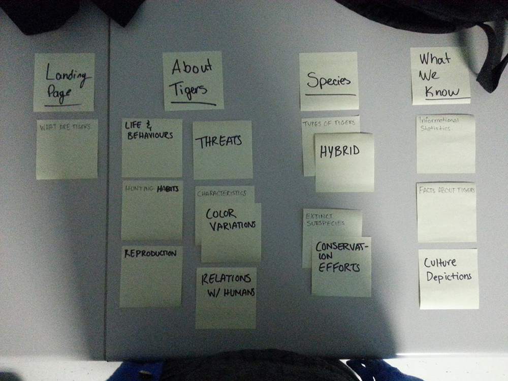
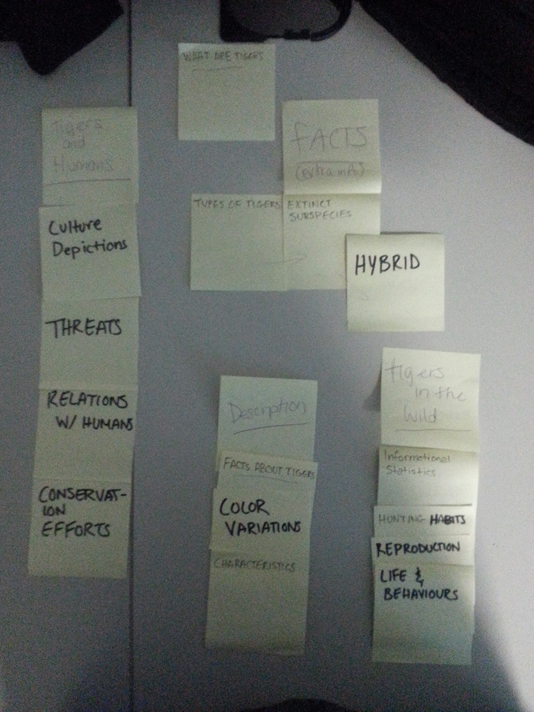

# Card sort report

The purpose of this card sort was to determine common navigation patterns and categories from the content of {your large data-oriented website}.

## Specifics

The card sort was conducted by Mansura Chowdhury on 10/09/13 between the times of 8 AM and 11 AM with the following participants:

- Robyn Rutherford
- Stephanie Cansfield

### Cards
15 cards were used covering a broad range of applicable content for the website. The following topics were used as cards:

1. What are Tigers
2. Life and Behaviours
3. Hunting Habits
4. Reproduction
5. Threats
6. Characteristics
7. Color variations of Tigers
8. Relations With Humans
9. Types of Tigers
10. Hybrid
11. Extinct Subspecies
12. Conservation Efforts
13. Informational Statistics (Basic Info)
14. Facts about Tigers
15. Culture Depictions

## Card sort results

*Card sort 1 by Robyn Rutherford*

*Card sort 2 by Stephanie Cansfield*

## Observations

- Yes, the participants had some things in common, such as the topics relating to the species of tigers. As well as putting characteristics and color variations together.

- Both were confused as to how to categorize the topics

- They struggled with topic related to the facts and statistics of tigers. As well as topics about the different kinds of tigers; including different color variations of tigers (my wording for the topic may have been confusing)

- For the most part, it is a bit of both. Some of the topics were grouped together from both participants, yet some other topics are placed completely differently.

- Yes, the results were similar to my expectations for the most part. 

- I felt confused just as they were considering the fact that my topic choses for some were not as clear and straightforward as I wanted them to be.